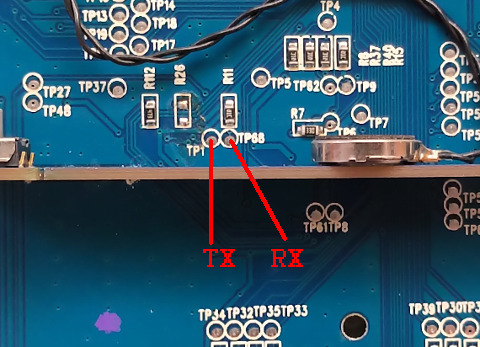

# RG99

  
## Introduction
Thanks Paul Cercueil and Opendingux development team. OpenDingux system is getting better and better. Based on OpenDingux resource, now, Linux OS can run on RG99 handheld. If you would like to port some emulators or games into this device, you can follow the build instruction below, thanks !  
  
|Component|Description                                 |
|---------|--------------------------------------------|
|CPU      |Ingenic JZ4725B 360MHz                      |
|RAM      |32MB                                        |
|Storage  |256GB                                       |
|Screen   |2.8" 320x480                                |
|Slot     |MicroSD                                     |
|Gamepad  |DPad, 4 Buttons, M1, M2, Start, Select, L, R|
|USB      |Client                                      |
|Battery  |3.7V 1800mA                                 |
|Dimension|119mm x 82mm x 25mm                         |
|Weight   |325g                                        |
|Others   |Vibrator                                    |
  
## How to build Linux OS for RG99  
### prepare environment
-  Debian 9 (x64)
-  all of source code and prebuilt binary can be found from release page
  
### configure toolchain
-  extract toolchain_rg99.7z into /opt/rg99
-  export command
   -  export PATH=$PATH:/opt/rg99/usr/bin
   
### build buildroot
-  download buildroot.tar.gz from release page
-  command
   -  $ tar xvf buildroot.tar.gz
   -  $ cd buildroot
   -  $ make rg99_defconfig
   -  $ make
  
### build kernel
-  download kernel_v1.0.tar.gz from release page
-  command:
   -  $ $ tar xvf kernel_v1.0.tar.gz
   -  $ cd kernel
   -  $ ARCH=mips CROSS_COMPILE=mipsel-linux- make rg99_defconfig
   -  $ ARCH=mips CROSS_COMPILE=mipsel-linux- make uzImage.bin dtbs -j8
-  for kernel (enable UART), copy "arch/mips/boot/dts/ingenic/rg99_dbg.dts" to "arch/mips/boot/dts/ingenic/rg99.dts"
-  for kernel (disable UART), copy "arch/mips/boot/dts/ingenic/rg99_rel.dts" to "arch/mips/boot/dts/ingenic/rg99.dts"
  
### flash bootloader
-  download flasher.tar.gz from release page
-  put RG99 into boot mode (Press START and then power up)
-  plug USB into PC
-  command:
   -  $ sudo flash.sh
  
### flash system
-  download v1.0_sdcard.img.7z from release page
-  prepare 4GB MicroSD
-  flash sdcard.img into MicroSD
-  put MicroSD into RG99 and then power up
  
## UART debug
-  solder UART
-  
-  download v1.0_boot_dbg.tar.gz from release page
-  overwrite uzImage.bin and rg99.dtb in boot partition (MicroSD)
-  open minicom or putty with baudrate 57600bps
-  use root login
-  now, you can start to debug your program (gdb and perf tools are preinstalled in rootfs already)
-  if you want to disable gmenu2x from boot, edit "etc/init.d/S01syslogd" and then comment out "/etc/main &"
-  all of post tasks are put in "/usr/sbin/post_init" file (include audio init and USB storage init)
  
### https://steward-fu.github.io/website/index.htm
