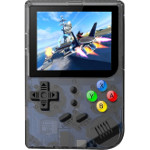

# RG99

  
## Introduction
Thanks Paul Cercueil and Opendingux development team. OpenDingux system is getting better and better. Based on OpenDingux resources, now, Linux OS can run on RG99 handheld. If you would like to port some emulators or games into this device, you can follow the build instrcution below, thanks !  
  
|Component|Description                                 |
|---------|--------------------------------------------|
|CPU      |Ingenic JZ4725B 360MHz                      |
|RAM      |32MB                                        |
|Storage  |256GB                                       |
|Screen   |2.8" 320x240                                |
|Slot     |MicroSD                                     |
|Gamepad  |DPad, 4 Buttons, M1, M2, Start, Select, L, R|
|USB      |Client                                      |
|Battery  |3.7V 1800mA                                 |
|Dimension|119mm x 82mm x 25mm                         |
|Weight   |325g                                        |
|Others   |Vibrator                                    |
  
## How to build Linux OS for RG99  
### prepare environment
-  Debian 9 (x64)
-  download all of sources in release page
  
### configure toolchain
-  extract toolchain_rg99.7z into /opt/rg99
-  export command
   -  export PATH=$PATH:/opt/rg99/usr/bin
   
### build buildroot
-  download buildroot.tar.gz from release page
-  command
   -  $ tar xvf buildroot.tar.gz
   -  $ cd buildroot
   -  $ make rg99_defconfig
   -  $ make
   
  
### https://steward-fu.github.io/website/index.htm
